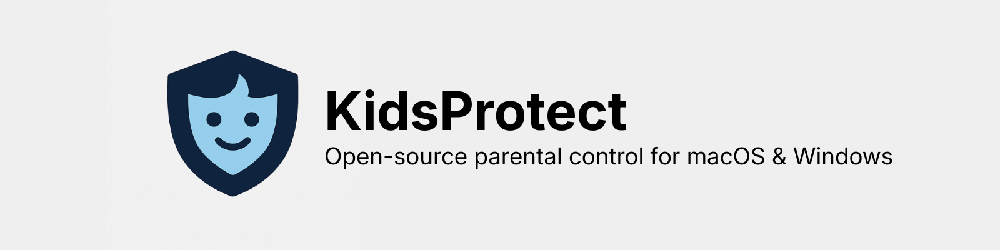

<p align="center">
  
</p>
<p align="center">
  
  
  
  
  
  
</p>

<p align="center">
  Desktop app for enabling a “lockdown” mode and managing per-domain allow/deny lists. On macOS it programs PF and `/etc/hosts`; on Windows it programs `netsh advfirewall` rules and      `hosts`, keeping the UI, backend, and system rules in sync.
</p>

## Quick links

- [Quick start](#quick-start)
- [Build for release](#build-for-release)
- [Install from releases](#install-from-releases)
- [Security notes](#security-notes)
- [Disclaimer](#disclaimer)
- [Contributing](Contributing.md)
- [License](LICENSE)

## What it does

- One-click lockdown that blocks all outbound traffic except whitelisted domains.
- Per-domain allow/deny lists with normalization to avoid duplicates.
- macOS: PF anchor + `/etc/hosts` entries; Windows: `netsh advfirewall` rules + `hosts`.
- Electron shell bundles the React frontend and backend service for offline use.

## Project layout

- `frontend/` — React + Vite UI (Tailwind 4, Zustand, Radix).
- `backend/` — Bun/Express service that applies firewall/hosts rules.
- `desktop/` — Electron wrapper that runs the backend and serves the packaged UI.
- `bun.lock`, `package.json` — workspace tooling.

## Requirements

- Bun ≥ 1.3
- Node.js ≥ 18 (needed by Electron and when running the backend as a service)
- macOS 12+ or Windows 10/11 for system rule control

## Quick start

```bash
bun install
bun dev   # runs frontend, backend, and desktop together
```

The backend listens on `http://localhost:8787` and the frontend dev server on `http://localhost:5173` by default.

## Build for release

```bash
# frontend
cd frontend && bun run build
# backend
cd backend && bun run build
# desktop (Electron)
cd desktop && bun run dist   # or from desktop: bun run build-all
```

Artifacts land in `desktop/release/` (DMG on macOS, NSIS installer on Windows when built on that platform).

## Install from releases

- Download the latest release from GitHub Releases (DMG for macOS, NSIS installer for Windows).
- macOS: open the DMG and drag KidsProtect to Applications. First launch may prompt for admin rights to apply PF/hosts rules.
- Windows: run the installer. UAC will prompt when creating firewall rules or services. The backend listens on localhost for the Electron UI.

## Security notes

- The backend is unauthenticated; run it bound to `127.0.0.1` and keep it firewalled when elevated.
- Avoid shipping personal state; do not bundle local `backend/state.json` in releases if it contains your data.

## Disclaimer

KidsProtect is provided "as is" without warranty of any kind. It modifies system networking rules and may disrupt connectivity or other software. Use at your own risk; ensure you have the necessary admin rights and backups. See the GPL-3.0 [LICENSE](LICENSE) for warranty and liability terms.

## Contributing

See [Contributing.md](Contributing.md) for development flow and PR guidelines.

## License

GPL-3.0 — see [LICENSE](LICENSE).
